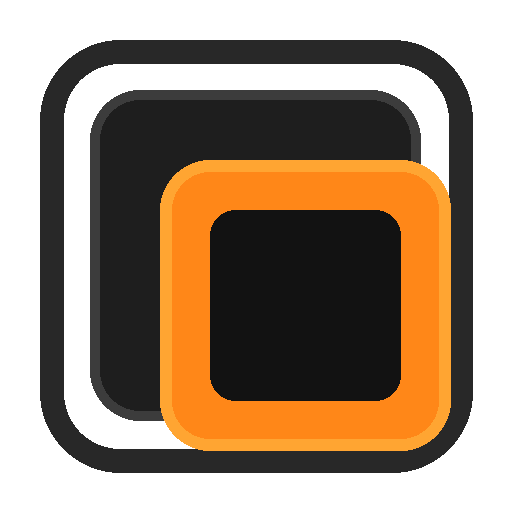

<div align="center">
  
  <h1>⚡ ChronioBox</h1>
  <p><b>El entorno de virtualización web y de escritorio definitivo, ligero y moderno.</b></p>

  <p>
    <a href="https://github.com/anyelo888ra-ux/ChronioBox-open-source/releases"></a>
    <a href="https://chroniobox.duckdns.org/"></a>
    
  </p>
</div>

---

## 🚀 ¿Qué es ChronioBox?
**ChronioBox** es una potente plataforma de virtualización inspirada en los entornos clásicos pero optimizada para la nube y el escritorio moderno. Funciona tanto como un panel web interactivo en línea como una aplicación nativa de escritorio rápida, ligera y segura.

---

## ✨ Características Principales
- 🖥️ **Cliente de Escritorio Nativo:** Desarrollado con Python, PyQt5 y PyQtWebEngine para ofrecer una experiencia fluida sin barras de navegador molestas.
- 🌐 **Sincronización Cloud:** Conectado directamente al nodo oficial en vivo (`https://chroniobox.duckdns.org/`).
- ⚡ **Emulación Integrada:** Compatible con perfiles de sistemas virtuales basados en tecnología web y navegadores aislados.
- 🎨 **Identidad Visual Pro:** Diseño oscuro moderno con detalles en tonos ámbar y naranja adaptados al flujo de trabajo técnico.

---

## 📥 Descargas Multiplataforma (Ejecutables Listos para Usar)
¡Ya no necesitas configurar entornos de desarrollo complejos! Ve a la sección de **[Releases](../../releases)** y descarga el paquete correspondiente a tu sistema operativo:

*   **💻 Windows:** Descarga `ChronioBox-Windows.exe` (o el paquete `.zip`), haz doble clic y ¡listo!
*   **🐧 Linux (Ubuntu/Debian/etc):** Descarga `ChronioBox-Linux`. Recuerda darle permisos de ejecución desde la terminal con `chmod +x ChronioBox-Linux` antes de abrirlo.
*   **🍏 macOS:** Descarga `ChronioBox-macOS` para ejecutar de forma nativa en tu computadora Apple.


---

## 🛠️ Compilación desde el Código Fuente (Open Source)
Si prefieres clonar el repositorio y compilar tu propio ejecutable de forma local, sigue estos pasos:

1. **Clona el repositorio:**
   ```bash
   git clone [https://github.com/anyelo888ra-ux/ChronioBox-open-source.git](https://github.com/anyelo888ra-ux/ChronioBox-open-source.git)
   cd ChronioBox-open-source
   ```
   Instala las dependencias necesarias:
   pip install PyQt5 PyQtWebEngine Pillow pyinstaller


   Genera tu propio icono (Opcional):
   python generater icon.py
   python convertir.py

   Compila el archivo .exe con PyInstaller:
   pyinstaller --noconsole --onefile --icon=icono.ico app.py

   El ejecutable final se generará automáticamente dentro de la carpeta dist/.
   
